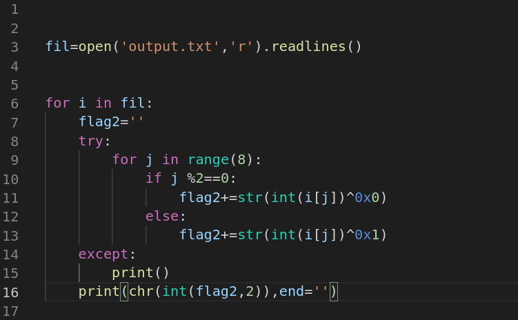

# Description 

As we can see in setup.jpg ,this is an arduino pcb connected to somekind of a chip on a breadboard 

And we are given a smiulation of the circuit too,to make the connections clear.

And there's as well the sketch code that's running on the arduino in the source.ino file , and the output of the system in the output.txt file , which looks looks like binary  

## solve
First of all let's see what's the chip on the bread board , so i search for 4070 pinout to understand how the chip works and i found this .

So it turns out the it's an xor chip which is taking one input from the arduino and the other from the ground (0) or the vcc (1) and xor them. 

Now let's take a look at the sketch code , it has a function that transfers every character from the flag into binary byte  
and the setup function just to declare the input and the output pins , and the loop function which is like the main  function in other languages .

As we can see it converts every character from the flag into binary then divides it into 2 sections , every section is 4 bits and then it calls the get_output function :

At first it writes 1 to the breadboard if the bit is one and zero if the bit is zero and then saves the output in the output coming from the 4070 chip to the output variable , and from what we can see from the simulation it xors the bit number 0 with and 1 with one , number2 bit with 0 and the fourth one with 1 , if we apply it to the entire byte it xors the even number bit with 0 and the odd with 1   

A quick script to solve it :

Flag :

